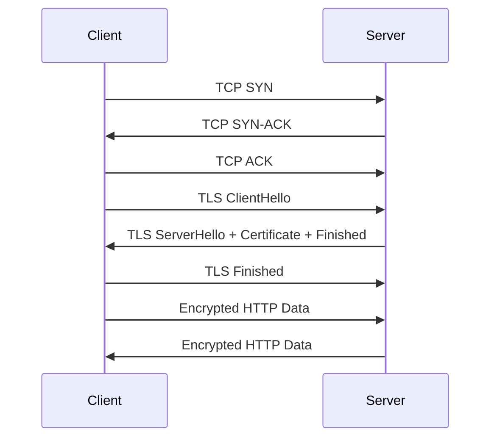
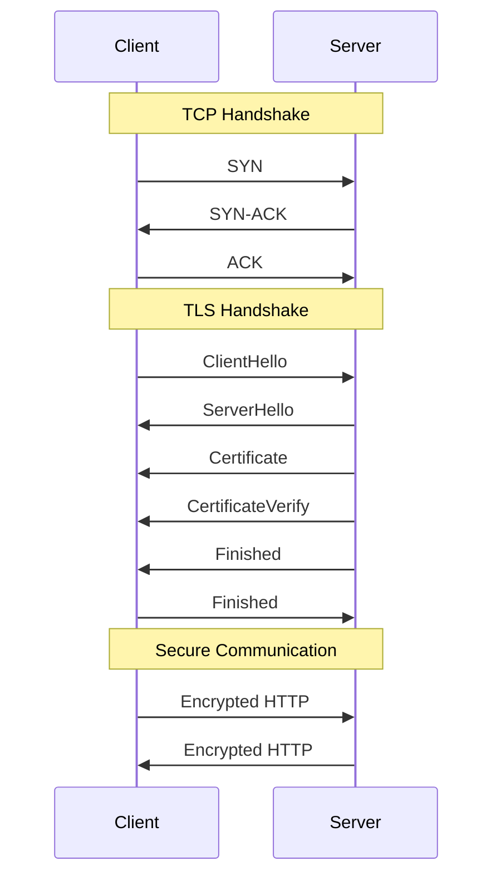

---

# TLS 1.3 Handshake Explained

## Overview

When you visit a website using HTTPS:

```
https://example.com
```

TLS provides three important guarantees:

1. **Encryption**
   - Prevents others from reading your data.

2. **Authentication**
   - Proves you are communicating with the real server.

3. **Integrity**
   - Prevents messages from being modified unnoticed.

---

# The Big Picture

A typical HTTPS connection happens in three stages:



---

# Protocol Layers

The communication stack looks like:

```
HTTP
 |
TLS
 |
TCP
 |
IP
```

Each layer solves a different problem:

| Layer | Purpose |
|---|---|
| IP | Routes packets |
| TCP | Reliable delivery |
| TLS | Security |
| HTTP | Application communication |

---

# Step 1: TCP Handshake

Before TLS starts, TCP creates a reliable connection.

```
Client                         Server

SYN -------------------------->

       <---------------------- SYN-ACK

ACK -------------------------->
```

After this:

```
TCP connection = ESTABLISHED
```

TLS now runs over this TCP connection.

> Note:
>
> The TCP ACK does not contain ClientHello.
>
> They are separate messages.

A packet carrying ClientHello may have:

```
TCP Header:
    ACK = 1

TCP Payload:
    TLS Record
        ClientHello
```

The ACK is a TCP control flag.
The ClientHello is TLS data.

---

# Step 2: ClientHello

The client starts TLS.

```
ClientHello
    Supported TLS versions
    Supported cipher suites
    Random number
    Supported key exchange methods
    Extensions (SNI, ALPN, etc.)

```

It contains:

## Supported TLS Versions

Example:

```
TLS 1.3
TLS 1.2
```

The client says:

> "These TLS versions are supported."

---

## Supported Cipher Suites

Example:

```
TLS_AES_128_GCM_SHA256
TLS_AES_256_GCM_SHA384
```

A cipher suite defines the cryptographic algorithms used.

---

## Client Random

The client generates randomness:

```
client_random = random bytes
```

This contributes to key generation.

---

## Key Share (Ephemeral Key i.e temporary key)

The client generates a temporary key pair:

```
Client Ephemeral Private Key
             |
             |
             v
Client Ephemeral Public Key
```

Only the public key is sent.

The private key stays on the client.

## SNI (Server Name Indication)

If multiple websites share one IP address:
```
example.com
api.example.com
blog.example.com
```
the client tells the server:
```
I want:
example.com
```
so the correct certificate can be returned.

---

# Step 3: ServerHello

The server responds:

```
ServerHello
```

The server selects:

- TLS version
- Cipher suite
- Key exchange parameters

The server also creates an ephemeral (temporary) key pair:

```
Server Ephemeral Private Key
             |
             |
             v
Server Ephemeral Public Key
```

The public key is sent to the client.

---

# Step 4: Creating the Shared Secret

TLS 1.3 uses ephemeral Diffie-Hellman key exchange.

The client calculates:

```
Client Private Key
+
Server Public Key

        |
        v

Shared Secret
```

The server calculates:

```
Server Private Key
+
Client Public Key

        |
        v

Shared Secret
```

Both sides independently arrive at the same value:

```
Client Shared Secret
          =
Server Shared Secret
```

The shared secret is never transmitted.

---

# Ephemeral Keys

## What does ephemeral mean?

Ephemeral means:

> Temporary and created only for one session.

Example:

```
TLS connection starts

Client creates:
    client_private_key_123

Server creates:
    server_private_key_456
```

When the connection closes:

```
Delete:

client_private_key_123
server_private_key_456
```

---

# Step 5: Server Certificate

Now the server proves its identity.
The server sends:

```
Certificate
```

The certificate contains:

```
Domain:
example.com

Server Public Key:
PK_server

Signed by:
Certificate Authority
```

The certificate binds:

```
Identity
    +
Public Key
```

---

# Step 6: Certificate Authority Verification

The browser verifies the certificate chain.

Example:

```
Browser Trust Store

        |
        v

Root CA Certificate

        |
        v

Intermediate CA Certificate

        |
        v

example.com Certificate
```

The browser already contains trusted CA certificates.

It checks:

- Certificate signature
- Expiration date
- Domain name
- Trust chain


## More Details

The key idea is that your browser/operating system does not need to have every certificate authority (CA) certificate directly. It needs to have a set of trusted root certificates, and it can verify a chain of trust from the website's certificate back to one of those trusted roots.

Let's walk through an example.

Suppose you visit:
```
https://example.com
```


The server sends your browser a certificate:
```
Certificate 1:
Subject: example.com
Issuer: A
```


Meaning: `"This certificate for example.com was signed by CA A."`

Your browser asks:

`"Do I trust A?"`

Maybe it does not have A directly. So it looks at the issuer of A's certificate:
```
Certificate 2:
Subject: A
Issuer: B
```


Then:
```
Certificate 3:
Subject: B
Issuer: C
```

Then:
```
Certificate 4:
Subject: C
Issuer: Root CA
```

Your machine has:

Trusted Root CA certificate


stored in its trust store.

So the chain is:
```
example.com certificate
        |
        | signed by
        v
       A CA certificate
        |
        | signed by
        v
       B CA certificate
        |
        | signed by
        v
       C CA certificate
        |
        | signed by
        v
       Trusted Root CA (already trusted)
```

The browser verifies each signature upward:
```
Did A really sign the example.com certificate?
Did B really sign A's certificate?
Did C really sign B's certificate?
Do I trust C because C chains to a root certificate I already trust?
```
If all checks pass, the browser says:

"I trust this website certificate."

**Where are these trusted certificates stored?**

It depends on the platform:
```
Windows: Mostly in the Windows Certificate Store.
macOS/iOS: Apple's Keychain/trust store.
Android: Android system CA store (with some browser-specific behavior).
Linux: Usually system CA bundles, often managed by packages like ca-certificates.
Firefox: Historically maintained its own CA store (separate from the OS); newer versions vary by platform.
Chrome/Edge: Generally use the OS trust store (with some exceptions).
```

So the trust anchor is usually a root CA certificate already installed on your machine.

One subtle but important detail .The root certificate is special:
```

Root CA certificate
Issuer: Root CA
Subject: Root CA
```

It is usually self-signed. There is no higher authority that proves the root is trustworthy. Your operating system vendor (Microsoft, Apple, Google, Linux distributors, etc.) decides which roots to include.

So the ultimate trust comes from:

Operating system/browser vendor says:
"I trust this root CA."

Everything below it inherits that trust through cryptographic signatures.

Your mental model of:

`"I don't have A, but I have C, and A chains back to C"`

is exactly how the TLS public key infrastructure (PKI) model works.

---

# Step 7: CertificateVerify

A certificate alone is not enough.

Anyone could copy a certificate.

The server must prove:

> "I own the private key corresponding to this certificate."

---

# TLS Handshake Transcript

The transcript is the complete history of TLS handshake messages.

Example:

```
ClientHello

ServerHello

EncryptedExtensions

Certificate
```

Both sides compute:

```
Handshake Messages

        |
        v

SHA-256

        |
        v

Transcript Hash
```

---

# Server Signature

The server creates:

```
Signature =
    Sign(
        Transcript Hash,
        Server Private Key
    )
```

The client verifies:

```
Verify(
    Signature,
    Transcript Hash,
    Server Public Key
)
```

The server public key comes from the certificate.

If verification succeeds:

```
The server owns the certificate private key.
```

---

# Step 8: Deriving Symmetric Keys

The shared secret is not used directly.

TLS uses HKDF:

```
Shared Secret

      |
      v

HKDF

      |
      v

Session Keys
```

TLS derives separate keys:

```
Client:

    Client Write Key
    Client IV


Server:

    Server Write Key
    Server IV
```

---

# Why Separate Keys?

Bad design:

```
Client ---> Server
       Same Key

Server ---> Client
       Same Key
```

Better:

```
Client ---> Server

Client Write Key


Server ---> Client

Server Write Key
```

Each direction has independent keys.


# Explanation

The idea is that TLS does not use one shared encryption key for both directions of communication. Instead, it derives separate keys for traffic flowing from the client to the server and traffic flowing from the server to the client.

Think of a TLS connection as two one-way encrypted channels:

```
Client  ==================>  Server
          Client Write Key

Client  <==================  Server
          Server Write Key
```

Why not use the same key in both directions?

A simple design might look like this:

```
              Same Key

Client  ----------------->  Server
Client  <-----------------  Server
              Same Key
```


This works cryptographically in some cases, but it is considered poor design because:

1. Keys become less isolated
   If the same key protects both directions, any weakness or misuse affecting one direction also affects the other.
   
   Example: 
   * Client sends encrypted messages using key K.
   * Server sends encrypted messages using the same key K.
    Now both traffic streams depend on the same secret. A problem in either direction potentially affects both.
    
2. It prevents clean separation of security contexts
   
   The client-to-server direction and server-to-client direction are logically different channels.
   
   For example:
   
```
	Client → Server:
		"GET /account"

	Server → Client:
		"HTTP response data"

```


These messages have different roles. Giving them different keys means TLS can reason about them independently.

3. It helps prevent reflection attacks

A reflection attack happens when an attacker tries to take a message from one direction and replay it back in the opposite direction.

Example with a shared key:

```
Client                    Server

  "prove you know secret"
        -------->

        attacker copies it

        <--------
  same encrypted message

```


If both directions use the same cryptographic keys and formats, the attacker may have opportunities to make a message generated for one side look valid for the other.

With separate keys:

```
Client → Server uses:

Client Write Key = K1


Server → Client uses:

Server Write Key = K2

```

A message encrypted with K1 cannot be accepted as a valid server message because the server-to-client direction expects K2.

**What are Client Write Key and Server Write Key?**

During the TLS handshake, both sides derive a shared secret. They do not directly use that secret as the encryption key.

Instead, they run a key derivation function (KDF) to create multiple secrets:
```
                 Master Secret
                       |
                       |
              Key Derivation Function
                       |
       --------------------------------
       |                              |
Client Write Key              Server Write Key
Client IV                     Server IV

```


The client uses:
```
Encrypt:
Client → Server

Key = Client Write Key
IV  = Client IV

```


The server uses:
```
Encrypt:
Server → Client

Key = Server Write Key
IV  = Server IV

```

**What about decryption?**

The names can be confusing. "Write" means the side that owns the key for sending.

The server stores both:
```
For receiving from client:
Client Write Key

For sending to client:
Server Write Key

```

The client stores the opposite:
```
For sending:
Client Write Key

For receiving:
Server Write Key

```

Both sides know both keys, but each direction uses only one.

**Modern TLS goes further**

In TLS 1.3, the separation is even stronger. The handshake derives independent traffic secrets:

```
client_handshake_traffic_secret
server_handshake_traffic_secret

client_application_traffic_secret
server_application_traffic_secret

```

Those secrets are then expanded into encryption keys and IVs.

So the principle is:

**One connection, two independent encrypted streams: one for client-to-server traffic and one for server-to-client traffic.**

This improves isolation, prevents certain classes of attacks, and makes the protocol easier to analyze securely.

---

# Step 9: Finished Messages

Finished messages prove both sides derived the same secrets.

Server sends:

```
Finished
```

Conceptually:

```
Finished =
    HMAC(
        Finished Key,
        Transcript Hash
    )
```

Client verifies it.

Then client sends:

```
Finished
```

Server verifies it.

Now both sides agree:

```
Same handshake
Same secrets
Same keys
```

---

# Step 10: Encrypted Application Data

Now HTTPS begins.

Example:

HTTP request:

```
GET /index.html
```

TLS encrypts it:

```
HTTP Data

    |
    v

TLS Encryption

    |
    v

Encrypted TLS Record

    |
    v

TCP
```

An attacker sees:

```
Random encrypted bytes
```

Not:

```
GET /login
username=alice
password=password123
```

---

# Complete TLS 1.3 Flow



---

# Final Mental Model

```
Certificate
    |
    | proves identity
    v

Public/Private Key Cryptography
    |
    | authenticates server
    v

Ephemeral Diffie-Hellman
    |
    | creates shared secret
    v

HKDF
    |
    | derives session keys
    v

Symmetric Encryption
    |
    | protects data
    v

HTTPS
```

---

# Key Takeaways

1. TCP creates a reliable connection.
2. TLS creates a secure connection.
3. ClientHello starts TLS negotiation.
4. Ephemeral keys create a temporary shared secret.
5. Certificates prove server identity.
6. CertificateVerify proves ownership of the certificate private key.
7. HKDF converts the shared secret into encryption keys.
8. Finished messages confirm both sides derived the same secrets.
9. Symmetric encryption protects all application data.
10. Ephemeral keys provide forward secrecy.
